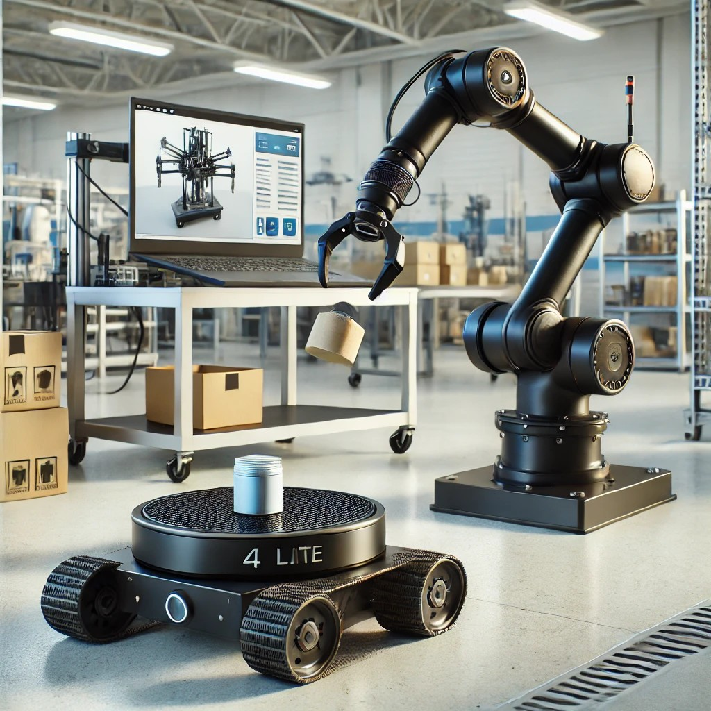
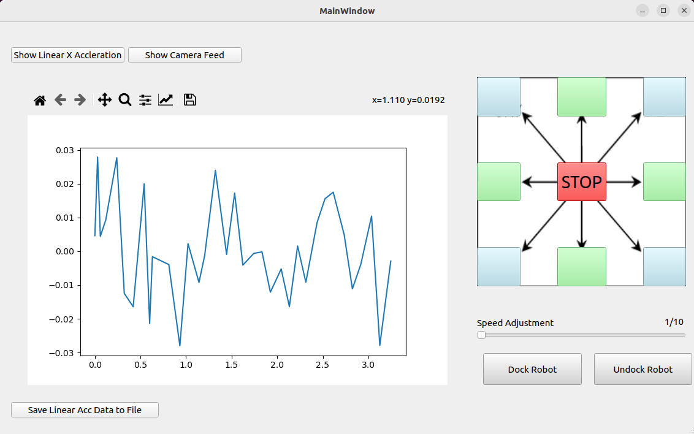
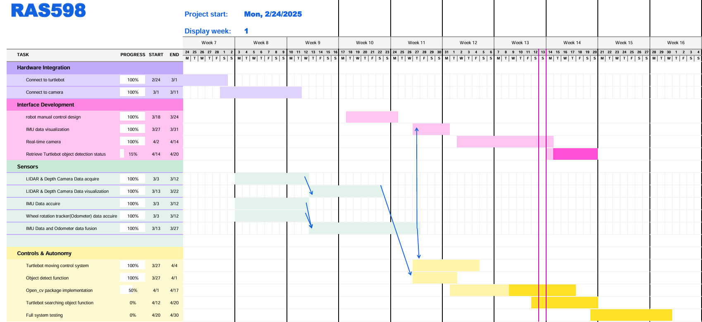
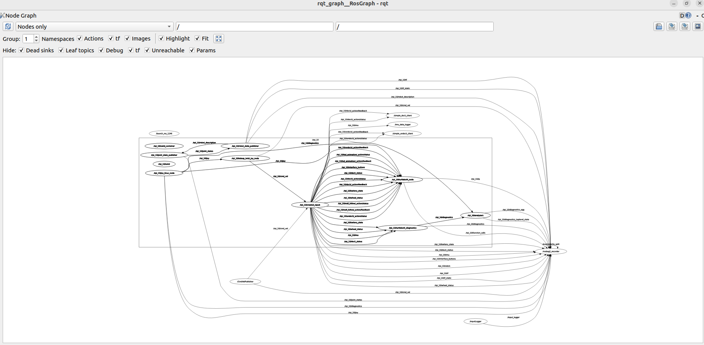

# Collaborative Robot Assistant for Object Transport & Assembly

## **Team Information**
**Team Number:** 6  
**Team Members:** Jeremy Chen, Chieh Kao, Hsing-Cheng Wang  
**Semester and Year:** Spring 2025  
**School:** Arizona State University  
**Class:** RAS598 - Experimentation and Deployment of Robotic Systems  
**Professor:** Daniel Aukes  

### **Introduction**
As a variety of robots are being increasingly used in manufacturing settings, we are inspired to create a minimal project that covers the three aspects of automated manufacturing: application, collaboration, and simulation. In a real-world warehouse, mobile robots transport items, while robotic arms handle detailed tasks like picking & placing, sorting, and assembly. In this project we will leverage ROS 2 for communication and SLAM for navigation (TurtleBot). We will be integrating a TurtleBot 4 Lite and CV2 package  for object transport and manipulation. We would also like to dig into the concept of creating digital twins to simulate the behavior of each robot and further verify it with a real-world scenario.

**Research Question**  
*"A minimal automated manufacturing setting including an object transporting robot, object manipulating robot arm, and a real-time simulation."*  

**Sample Figure**
The following image is created by AI just for explanation purposes.

---

### **Sensor Integration**
#### **How will sensor data be used in the code?**
- **TurtleBot 4 Sensors:**
    - **LIDAR & Depth Camera:** Used for SLAM-based navigation, object detection, and obstacle avoidance.
    - **IMU (Inertial Measurement Unit):** Helps improve localization and detect unexpected collisions.
    - **Wheel rotation tracker:** For the localization of turtlebot.

To utilize sensors on the TurtleBot, we plan to feed the sensor inputs, including the CV2 package object detection system, to our local host computer because we suspect that SLAM navigation will require significant computing power, which might overwhelm the Raspberry Pi on the TurtleBot. By inputting the LIDAR and depth camera sensor data, along with the CV2 package-based traffic light detection, to the local computing power, we will return the navigation results to the TurtleBot to command its movement.

---

### **Interaction & User Interface**
To control and monitor the robots, we will be building a dashboard on the ROS-based UI. The dashboard will include to separate sections as shown in the figure below. On the left side will be the simulation, and on the right side will be all the controls needed. The controls will simply be start, stop, and emergency stop. Another window will show the path that is rendered from the data from Turtlebot.   

🟥**up to date GUI(4/13/2025)**

---

### **Control & Autonomy**
On the TurtleBot, we will use SLAM for autonomous navigation. The TurtleBot will detect when it has reached its destination, and upon doing so, it will send a ROS signal—such as detecting a QR code on the wall.

Once the robot arm receives the ROS signal from the TurtleBot, it will move toward the object and adjust its speed according to the traffic light signal. The TurtleBot will continue navigating, and once it reaches a certain distance from the target, the robot arm will perform the necessary manipulation. Finally, the system will send a completion signal to the TurtleBot, enabling it to proceed to the next task.

---

### **Preparation Needs**
In order to build a Collaborative Robot Assistant with the TurtleBot 4, we need to understand ROS 2 communication, including Topics for real-time data exchange, Services for request-response interactions, and Actions for handling asynchronous tasks. SLAM optimization is important for the TurtleBot’s accurate navigation, ensuring robust mapping and localization. Additionally, we will use Gazebo simulation for testing and refining the system in a virtual environment.

---

### **Final Demonstration**
In this demonstration, we will showcase a minimal automated manufacturing setup where a TurtleBot 4 autonomously navigates while transporting an object. The TurtleBot will use CV2 package to detect traffic lights in its environment and interpret the signal color. Upon detecting a green light, the TurtleBot will continue to move forward at its normal speed. When a yellow light is detected, it will slow down and proceed with caution. If a red light is detected, the TurtleBot will stop completely.

In case of conflicting signals, the following prioritization will apply:

If both green and yellow lights are detected, the yellow light will take priority.

If red, yellow, and green lights are detected simultaneously, the red light will be prioritized, causing the TurtleBot to stop.

This decision-making process ensures that the TurtleBot behaves appropriately in various traffic scenarios, mimicking the response of a real vehicle to traffic lights.

The TurtleBot will continue to follow its designated path or goal, tracking its target according to the programmed instructions. If it encounters a traffic light, it will adjust its movement based on the detected signal color, ensuring safe navigation in a simulated traffic environment.

The system will demonstrate real-time multi-robot collaboration, SLAM-based navigation, and adaptive object manipulation, simulating an industrial setting.

#### **Resources Needed**
- TurtleBot 4 with a carrying tray(maybe)
- TurtleBot 4 (possibly equipped with a carrying tray for object transport)
- ROS 2-based computing setup for communication and coordination
- LiDAR, depth camera, IMU, and force-torque sensors for navigation and manipulation feedback

#### **Classroom Setup**
- Open floor space: Ensuring sufficient area for TurtleBot 4 to navigate safely.
- Elevated Track System: Depending on the demonstration needs, we may arrange tables to form a track-like platform for TurtleBot 4, allowing it to operate at the same height as the traffic light system. This will ensure seamless interaction between the TurtleBot and the traffic light system, enabling it to detect and respond to traffic light signals effectively.
- Minimal environmental interference: Avoid excessive lighting changes or obstructions that may interfere with the LiDAR, depth camera, or CV2 package-based traffic light detection.

#### **Handling Variability**
The system is designed to dynamically adapt to environmental changes by incorporating various strategies. TurtleBot 4 utilizes LiDAR and a depth camera to identify and avoid unexpected obstacles in real-time, ensuring smooth navigation. Depth sensors compensate for lighting variations, allowing the system to function reliably under changing light conditions.

TurtleBot will use CV2 package to detect traffic lights in its environment and adjust its speed accordingly. If a green light is detected, it will continue moving at its normal speed. If a yellow light is detected, it will slow down. If a red light is detected, it will stop. This dynamic adjustment ensures that TurtleBot responds appropriately to the traffic signal in real-time.

The table track system allows TurtleBot to maintain the required height alignment, ensuring smooth operation and effective interaction with the traffic light system.

#### **Testing & Evaluation**
To validate the system’s performance, we will evaluate key metrics that reflect its accuracy, efficiency, and adaptability. Navigation accuracy will be assessed by comparing TurtleBot 4’s planned path with its actual trajectory, measuring deviations, and making necessary SLAM adjustments. The system’s responsiveness to traffic lights will be evaluated by testing TurtleBot’s ability to detect and react appropriately to traffic light signals (green, yellow, and red) in real-time. The time taken to adjust its speed and stop based on the detected signal will also be measured.

Task completion time will be used to evaluate the overall efficiency of the TurtleBot in navigating and responding to traffic signals. This will ensure that each task, including navigation and signal response, is completed as swiftly and effectively as possible. Additionally, error recovery will be analyzed by examining the system’s ability to handle failures dynamically, such as detecting traffic lights in challenging lighting conditions or avoiding obstacles that may disrupt the planned path.

---

### **Impact**
As ROS2 is a new topic for all of us, we can learn the valuable lesson of how to integrate different systems and also to create a simulation with Gazebo. By going through a hands-on deployment of our system, we can have a grasp on the basic topics including but not limited to:
1. The communication among multiple robots.
2. Creating a simulation with Gazebo.
3. Sensor fusion.

We aim to create a **reproducible framework** for future multi-robot systems.

---

### **Advising**
In the near future, we will need guidance from Prof. Aukes, especially on SLAM for autonomous navigation and optimizing TurtleBot 4 Lite’s interaction with its environment. To successfully implement real-time traffic light detection and response, as well as to ensure smooth coordination and data flow, we will need Prof. Aukes’s advice on handling potential barriers in system integration. This will help us ensure that the TurtleBot operates efficiently, detecting and responding to traffic lights, and completes tasks seamlessly in a dynamic environment.

---
### **Gantt Chart Project Planning**

**up to date Gantt chart(04/13/2025)**

### **rqt_graph**

**latest rqt_graph(04/13/2025)**

### **Discussion**
 In this project, we use multiple sensors, including camera, IMU, and LiDAR, to enable the TurtleBot 4 to navigate autonomously and respond to traffic lights.
 Camera (YOLO-based Traffic Light Detection): 
 The camera captures video frames, which are processed to detect traffic lights using the YOLO object detection algorithm. The system classifies traffic lights into green, yellow, and red.
 Preprocessing: Image adjustments, such as brightness and contrast correction, are made to ensure consistent performance under varying lighting conditions.
 Usage: The detected traffic light color helps adjust TurtleBot's movement, e.g., stopping at red lights, slowing down for yellow, and proceeding at normal speed with green. 

 IMU (Inertial Measurement Unit):
 The IMU provides data on the robot's orientation and motion. 
 Filtering: IMU data is filtered to reduce noise using methods like complementary or Kalman filters, improving accuracy in detecting changes in direction and speed. 
 Usage: The filtered data ensures smooth navigation, helping the TurtleBot maintain accurate orientation even if there are minor errors or obstacles.
 
 LiDAR (Light Detection and Ranging):
 LiDAR is used for real-time mapping and obstacle detection.
 Data Conditioning: LiDAR data is cleaned by removing outliers to ensure accurate distance measurement.
 Usage: It helps build a local map, enabling the TurtleBot to avoid obstacles and maintain a clear path.
 
 Sensor Fusion:
 The data from the camera, IMU, and LiDAR are combined to enhance navigation and traffic light response. 
 Usage: Sensor fusion ensures that the TurtleBot adapts to changes in its environment, such as adjusting to traffic lights while avoiding obstacles.
 
 In summary, the system relies on these sensors to gather real-time data, which is processed and fused to ensure precise navigation and effective interaction with the environment.
