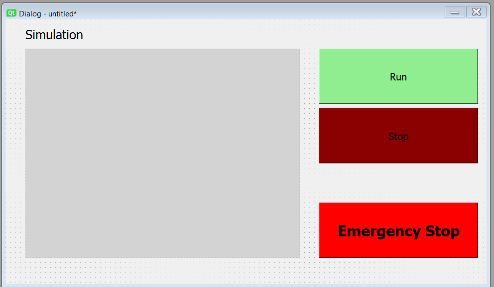

# Collaborative Robot Assistant for Object Transport & Assembly

## **Team Information**
**Team Number:** 6  
**Team Members:** Jeremy Chen, Chieh Kao, Hsing-Cheng Wang  
**Semester and Year:** Spring 2025  
**School:** Arizona State University  
**Class:** RAS598 - Experimentation and Deployment of Robotic Systems  
**Professor:** Daniel Aukes  

### **Introduction**
As a variety of robots are been increasingly used in manufacutring settings, we are inspired to create a mininal project that covers the three aspects of automated manufacturing: application, collaboration ,and simulation. In real-world warehouse, mobile robots transport items, while robotic arms handle detailed tasks like pick & place, sorting and assembly. In this project we will leverage **ROS 2 for communication, SLAM for navigation (TurtleBot), and Gazebo for simulation.**  We will be integrating a **TurtleBot 4 Lite** and a **UR5 robotic arm** for object transport and manipulation. We would also like to dig into the concept of creating digital twins to simulate the behavior of each robot and further verify it with the real world scenario. 

**Research Question:**  
*"A minimal automated manufactuing setting including a object transporting robot, object manipulating robot arm, and a real-time simulation."*  

---

### **Sensor Integration**
#### **How will sensor data be used in the code?**
- **TurtleBot 4 Sensors:**
  - **LIDAR & Depth Camera:** Used for SLAM-based navigation, object detection, and obstacle avoidance.
  - **IMU (Inertial Measurement Unit):** Helps improve localization and detect unexpected collisions.
  - **Wheel rotation tracker:** For the localization of turtlebot.

- **UR5 Sensors:**
  - **Force-Torque Sensor:** Provides haptic feedback for grasping adjustments.

To utilize sensors on each robot, we are planning to feed the sensor input to our local host computer, becasue we suspect the SLAM navigation will require significant amount of computing power, which might be overwhelming for the raspberry Pi on the turtlebot. By inputing the Lidar and Depth camera sensor data to local computing power, we will return the navigation result to the turtlebot to commmand its movement. As the turtlebot approaches the pickup destination, it will trigger a signal to start the UR5 robot arm. The robot arm will perfrom pick and place from the stack of objects and place it on top of the turtlebot. To correctly track the height of the stack of items, UR5 will utilize its torque sensor to gently tap the top of the stack to acquire the height of the top most item. The UR5 will send this torque data to the local computer for height calculation as well as for simulation purposes. 

On the simulation end, UR5 will be sending out the angles of each actuator, which will then be used in the simulation to reflect the orientation of the robot arm. Similarly, turtlebot will be sending the data from wheel speed sensor and the IMU to host computer. The host computer will then integrate the data from the two source, with the wheel speed sensor as the main input and the IMU as a reference in case of any unexpected incidents.

---

### **Interaction & User Interface**
To control and monitor the robots, we will be building a dashboard on the ROS-based UI. The dashboard will include to separate sections as shown in the figure below. On the left side will be the simulation, and on the right side will be all the controls needed. The controls will simply be start, stop and emergency stop. Another window will be showing the path that is rendered from the data from turtlebot.   

---

### **Control & Autonomy**
On TurtleBot, we will use SLAM for autonomous navigation, which will detect when it has reached the destination then sends a ROS signal, It can be a QR code on the wall for instance. On UR5, after receiving ROS signal from TurtleBot, robot arm will go to pick the parts from it and place it on the processing-ready zone. Then pick the processed part, place it on the TurtleBot. Finally, sends a completion signal to TurtleBot to continue the next task. 

---

### **Preparation Needs**
Inorder to build a Collaborative Robot Assistant with the TurtleBot 4 and UR5, we need to understand ROS 2 communication, including Topics for real-time data exchange, Services for request-response interactions, and Actions for handling asynchronous tasks. SLAM optimization is important for the TurtleBot’s accurate navigation, ensuring robust mapping and localization. For object manipulation, the UR5 relies on motion planning and inverse kinematics to do smooth and precise movements. Additionally, we will use Gazebo simulation for testing and refining the system in a virtual environment.

---

### **Final Demonstration**
The system will autonomously **transport an object via the TurtleBot 4**, and the **UR5 will manipulate it (pick & place)** in a real-world scenario.

#### **Resources Needed**
- **TurtleBot 4 with a carrying tray(maybe)**
- **UR5 robotic arm on a sturdy table**

#### **Classroom Setup**
- Open floor space for TurtleBot navigation.
- A fixed workspace for UR5 operations.

#### **Handling Variability**
- The system will adapt to environmental changes (e.g., obstacles, lighting variations) using **SLAM**.

#### **Testing & Evaluation**
- **Navigation Accuracy:** Measure deviation from planned vs. actual path.
- **Grasping Success Rate:** Percentage of successful picks by UR5.
- **Task Completion Time:** Efficiency of transport and manipulation.
- **Error Recovery:** System’s ability to handle failures dynamically.

---

### **Impact**
This project contributes to the study of **multi-robot collaboration**, enhancing skills in **ROS 2, motion planning, SLAM, and perception**. The work has practical applications in **smart warehouses, logistics, and industrial automation**.  

We aim to create a **reproducible framework** for future multi-robot systems.

---
